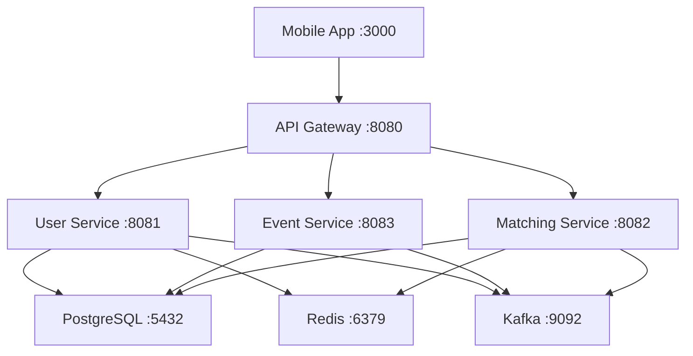

# Meetinity Mobile App - API Integration Guide

## Overview

The **Meetinity Mobile App** is a React-based progressive web application that serves as the primary user interface for the Meetinity professional networking platform. This document provides comprehensive API integration information and service communication details.

## Architecture Integration



## API Configuration

### Environment Variables
```env
# API Configuration
VITE_API_URL=http://localhost:8080
VITE_API_TIMEOUT=30000
VITE_API_RETRY_ATTEMPTS=3

# Authentication
VITE_JWT_STORAGE_KEY=meetinity_token
VITE_REFRESH_TOKEN_KEY=meetinity_refresh_token
VITE_TOKEN_REFRESH_THRESHOLD=300000  # 5 minutes before expiry

# OAuth Configuration
VITE_OAUTH_GOOGLE_CLIENT_ID=your-google-client-id
VITE_OAUTH_LINKEDIN_CLIENT_ID=your-linkedin-client-id
VITE_OAUTH_REDIRECT_URI=http://localhost:3000/auth/callback

# Feature Flags
VITE_ENABLE_PUSH_NOTIFICATIONS=true
VITE_ENABLE_GEOLOCATION=true
VITE_ENABLE_ANALYTICS=true
VITE_ENABLE_OFFLINE_MODE=true

# App Configuration
VITE_APP_NAME=Meetinity
VITE_APP_VERSION=1.0.0
VITE_SUPPORT_EMAIL=support@meetinity.com
```

### API Client Configuration
```typescript
// src/config/api.ts
export const API_CONFIG = {
  baseURL: import.meta.env.VITE_API_URL || 'http://localhost:8080',
  timeout: parseInt(import.meta.env.VITE_API_TIMEOUT) || 30000,
  retryAttempts: parseInt(import.meta.env.VITE_API_RETRY_ATTEMPTS) || 3,
  retryDelay: 1000,
  headers: {
    'Content-Type': 'application/json',
    'Accept': 'application/json',
    'X-Client-Version': import.meta.env.VITE_APP_VERSION || '1.0.0',
    'X-Client-Platform': 'web'
  }
};

// API Client with interceptors
import axios, { AxiosInstance, AxiosRequestConfig, AxiosResponse } from 'axios';

class ApiClient {
  private client: AxiosInstance;
  private refreshPromise: Promise<string> | null = null;

  constructor() {
    this.client = axios.create(API_CONFIG);
    this.setupInterceptors();
  }

  private setupInterceptors() {
    // Request interceptor for auth token
    this.client.interceptors.request.use(
      (config) => {
        const token = this.getStoredToken();
        if (token) {
          config.headers.Authorization = `Bearer ${token}`;
        }
        return config;
      },
      (error) => Promise.reject(error)
    );

    // Response interceptor for token refresh
    this.client.interceptors.response.use(
      (response) => response,
      async (error) => {
        const originalRequest = error.config;
        
        if (error.response?.status === 401 && !originalRequest._retry) {
          originalRequest._retry = true;
          
          try {
            const newToken = await this.refreshToken();
            originalRequest.headers.Authorization = `Bearer ${newToken}`;
            return this.client(originalRequest);
          } catch (refreshError) {
            this.handleAuthError();
            return Promise.reject(refreshError);
          }
        }
        
        return Promise.reject(error);
      }
    );
  }

  private async refreshToken(): Promise<string> {
    if (this.refreshPromise) {
      return this.refreshPromise;
    }

    this.refreshPromise = this.performTokenRefresh();
    
    try {
      const token = await this.refreshPromise;
      return token;
    } finally {
      this.refreshPromise = null;
    }
  }

  private async performTokenRefresh(): Promise<string> {
    const refreshToken = localStorage.getItem(import.meta.env.VITE_REFRESH_TOKEN_KEY);
    
    if (!refreshToken) {
      throw new Error('No refresh token available');
    }

    const response = await axios.post(`${API_CONFIG.baseURL}/api/auth/refresh`, {
      refresh_token: refreshToken
    });

    const { access_token, refresh_token: newRefreshToken } = response.data;
    
    localStorage.setItem(import.meta.env.VITE_JWT_STORAGE_KEY, access_token);
    localStorage.setItem(import.meta.env.VITE_REFRESH_TOKEN_KEY, newRefreshToken);
    
    return access_token;
  }

  private getStoredToken(): string | null {
    return localStorage.getItem(import.meta.env.VITE_JWT_STORAGE_KEY);
  }

  private handleAuthError() {
    localStorage.removeItem(import.meta.env.VITE_JWT_STORAGE_KEY);
    localStorage.removeItem(import.meta.env.VITE_REFRESH_TOKEN_KEY);
    window.location.href = '/login';
  }

  // Public API methods
  async get<T>(url: string, config?: AxiosRequestConfig): Promise<T> {
    const response = await this.client.get<T>(url, config);
    return response.data;
  }

  async post<T>(url: string, data?: any, config?: AxiosRequestConfig): Promise<T> {
    const response = await this.client.post<T>(url, data, config);
    return response.data;
  }

  async put<T>(url: string, data?: any, config?: AxiosRequestConfig): Promise<T> {
    const response = await this.client.put<T>(url, data, config);
    return response.data;
  }

  async delete<T>(url: string, config?: AxiosRequestConfig): Promise<T> {
    const response = await this.client.delete<T>(url, config);
    return response.data;
  }
}

export const apiClient = new ApiClient();
```

## API Endpoints Integration

### Authentication API
```typescript
// src/services/authService.ts
export interface LoginRequest {
  email: string;
  password: string;
}

export interface LoginResponse {
  access_token: string;
  refresh_token: string;
  user: UserProfile;
  expires_in: number;
}

export interface RegisterRequest {
  email: string;
  name: string;
  password: string;
}

export class AuthService {
  async login(credentials: LoginRequest): Promise<LoginResponse> {
    return apiClient.post<LoginResponse>('/api/auth/login', credentials);
  }

  async register(userData: RegisterRequest): Promise<LoginResponse> {
    return apiClient.post<LoginResponse>('/api/auth/register', userData);
  }

  async logout(): Promise<void> {
    try {
      await apiClient.post('/api/auth/logout');
    } finally {
      localStorage.removeItem(import.meta.env.VITE_JWT_STORAGE_KEY);
      localStorage.removeItem(import.meta.env.VITE_REFRESH_TOKEN_KEY);
    }
  }

  async refreshToken(): Promise<LoginResponse> {
    const refreshToken = localStorage.getItem(import.meta.env.VITE_REFRESH_TOKEN_KEY);
    return apiClient.post<LoginResponse>('/api/auth/refresh', {
      refresh_token: refreshToken
    });
  }

  // OAuth methods
  getGoogleAuthUrl(): string {
    const params = new URLSearchParams({
      client_id: import.meta.env.VITE_OAUTH_GOOGLE_CLIENT_ID,
      redirect_uri: import.meta.env.VITE_OAUTH_REDIRECT_URI,
      response_type: 'code',
      scope: 'openid email profile',
      state: this.generateState()
    });
    
    return `https://accounts.google.com/o/oauth2/v2/auth?${params.toString()}`;
  }

  getLinkedInAuthUrl(): string {
    const params = new URLSearchParams({
      client_id: import.meta.env.VITE_OAUTH_LINKEDIN_CLIENT_ID,
      redirect_uri: import.meta.env.VITE_OAUTH_REDIRECT_URI,
      response_type: 'code',
      scope: 'r_liteprofile r_emailaddress',
      state: this.generateState()
    });
    
    return `https://www.linkedin.com/oauth/v2/authorization?${params.toString()}`;
  }

  async handleOAuthCallback(code: string, state: string, provider: 'google' | 'linkedin'): Promise<LoginResponse> {
    return apiClient.post<LoginResponse>(`/api/auth/oauth/${provider}/callback`, {
      code,
      state,
      redirect_uri: import.meta.env.VITE_OAUTH_REDIRECT_URI
    });
  }

  private generateState(): string {
    const state = Math.random().toString(36).substring(2, 15);
    sessionStorage.setItem('oauth_state', state);
    return state;
  }
}

export const authService = new AuthService();
```

### User Profile API
```typescript
// src/services/userService.ts
export interface UserProfile {
  id: string;
  email: string;
  name: string;
  profile_picture_url?: string;
  bio?: string;
  location?: string;
  industry?: string;
  job_title?: string;
  company?: string;
  linkedin_url?: string;
  phone?: string;
  date_of_birth?: string;
  is_verified: boolean;
  created_at: string;
  updated_at: string;
}

export interface UserPreferences {
  age_min: number;
  age_max: number;
  location_radius: number;
  industries: string[];
  interests: string[];
  notification_email: boolean;
  notification_push: boolean;
  privacy_profile: 'public' | 'private' | 'connections';
  privacy_location: boolean;
}

export interface UpdateProfileRequest {
  name?: string;
  bio?: string;
  location?: string;
  industry?: string;
  job_title?: string;
  company?: string;
  linkedin_url?: string;
  phone?: string;
}

export class UserService {
  async getProfile(): Promise<UserProfile> {
    return apiClient.get<UserProfile>('/api/users/profile');
  }

  async updateProfile(updates: UpdateProfileRequest): Promise<UserProfile> {
    return apiClient.put<UserProfile>('/api/users/profile', updates);
  }

  async uploadAvatar(file: File): Promise<{ profile_picture_url: string }> {
    const formData = new FormData();
    formData.append('file', file);
    
    return apiClient.post<{ profile_picture_url: string }>('/api/users/profile/avatar', formData, {
      headers: {
        'Content-Type': 'multipart/form-data'
      }
    });
  }

  async getPreferences(): Promise<UserPreferences> {
    return apiClient.get<UserPreferences>('/api/users/preferences');
  }

  async updatePreferences(preferences: Partial<UserPreferences>): Promise<UserPreferences> {
    return apiClient.put<UserPreferences>('/api/users/preferences', preferences);
  }

  async deleteAccount(): Promise<void> {
    return apiClient.delete('/api/users/profile');
  }
}

export const userService = new UserService();
```

### Events API
```typescript
// src/services/eventService.ts
export interface Event {
  id: string;
  title: string;
  description?: string;
  location?: string;
  latitude?: number;
  longitude?: number;
  start_date: string;
  end_date?: string;
  max_attendees?: number;
  current_attendees: number;
  category: string;
  tags: string[];
  image_url?: string;
  is_virtual: boolean;
  virtual_link?: string;
  price: number;
  currency: string;
  status: 'active' | 'cancelled' | 'completed';
  created_by: string;
  created_at: string;
  is_registered?: boolean;
  registration_status?: 'registered' | 'cancelled' | 'attended' | 'no_show';
}

export interface CreateEventRequest {
  title: string;
  description?: string;
  location?: string;
  latitude?: number;
  longitude?: number;
  start_date: string;
  end_date?: string;
  max_attendees?: number;
  category: string;
  tags?: string[];
  is_virtual?: boolean;
  virtual_link?: string;
  price?: number;
}

export interface EventsResponse {
  events: Event[];
  total: number;
  page: number;
  limit: number;
  has_next: boolean;
  has_prev: boolean;
}

export interface EventFilters {
  category?: string;
  location?: string;
  date_from?: string;
  date_to?: string;
  price_max?: number;
  is_virtual?: boolean;
  tags?: string[];
  search?: string;
}

export class EventService {
  async getEvents(page = 1, limit = 20, filters?: EventFilters): Promise<EventsResponse> {
    const params = new URLSearchParams({
      page: page.toString(),
      limit: limit.toString(),
      ...filters
    });
    
    return apiClient.get<EventsResponse>(`/api/events?${params.toString()}`);
  }

  async getEvent(id: string): Promise<Event> {
    return apiClient.get<Event>(`/api/events/${id}`);
  }

  async createEvent(eventData: CreateEventRequest): Promise<Event> {
    return apiClient.post<Event>('/api/events', eventData);
  }

  async updateEvent(id: string, updates: Partial<CreateEventRequest>): Promise<Event> {
    return apiClient.put<Event>(`/api/events/${id}`, updates);
  }

  async deleteEvent(id: string): Promise<void> {
    return apiClient.delete(`/api/events/${id}`);
  }

  async registerForEvent(id: string): Promise<{ registration_id: string }> {
    return apiClient.post<{ registration_id: string }>(`/api/events/${id}/register`);
  }

  async unregisterFromEvent(id: string): Promise<void> {
    return apiClient.delete(`/api/events/${id}/unregister`);
  }

  async getEventAttendees(id: string): Promise<{ attendees: UserProfile[] }> {
    return apiClient.get<{ attendees: UserProfile[] }>(`/api/events/${id}/attendees`);
  }

  async getUserEvents(userId?: string): Promise<{ created: Event[], registered: Event[] }> {
    const endpoint = userId ? `/api/events/users/${userId}` : '/api/events/my-events';
    return apiClient.get<{ created: Event[], registered: Event[] }>(endpoint);
  }

  async searchEvents(query: string, filters?: EventFilters): Promise<EventsResponse> {
    const params = new URLSearchParams({
      search: query,
      ...filters
    });
    
    return apiClient.get<EventsResponse>(`/api/events/search?${params.toString()}`);
  }
}

export const eventService = new EventService();
```

### Matching API
```typescript
// src/services/matchingService.ts
export interface Match {
  id: string;
  user1_id: string;
  user2_id: string;
  compatibility_score: number;
  match_reason: {
    primary_factors: string[];
    shared_interests: string[];
    industry_match?: string;
    location_distance_km?: number;
  };
  status: 'pending' | 'mutual' | 'declined' | 'expired';
  matched_at: string;
  expires_at: string;
  other_user: UserProfile;
}

export interface PotentialMatch {
  user: UserProfile;
  compatibility_score: number;
  match_reason: {
    primary_factors: string[];
    shared_interests: string[];
    industry_match?: string;
    location_distance_km?: number;
  };
  distance_km?: number;
}

export interface SwipeRequest {
  swiped_user_id: string;
  action: 'like' | 'pass' | 'super_like';
  context?: {
    source: 'discovery' | 'event' | 'search';
    position_in_stack?: number;
  };
}

export interface SwipeResponse {
  is_match: boolean;
  match_id?: string;
  message?: string;
}

export interface MatchingPreferences {
  age_min: number;
  age_max: number;
  distance_km: number;
  industries: string[];
  job_levels: string[];
  company_sizes: string[];
  interests: string[];
  networking_goals: string[];
  preferred_meeting_types: string[];
  exclude_colleagues: boolean;
  exclude_competitors: boolean;
}

export class MatchingService {
  async getMatches(page = 1, limit = 20): Promise<{ matches: Match[], total: number }> {
    const params = new URLSearchParams({
      page: page.toString(),
      limit: limit.toString()
    });
    
    return apiClient.get<{ matches: Match[], total: number }>(`/api/matches?${params.toString()}`);
  }

  async getPotentialMatches(limit = 10): Promise<{ potential_matches: PotentialMatch[] }> {
    return apiClient.get<{ potential_matches: PotentialMatch[] }>(`/api/matches/potential?limit=${limit}`);
  }

  async swipe(swipeData: SwipeRequest): Promise<SwipeResponse> {
    return apiClient.post<SwipeResponse>('/api/matches/swipe', swipeData);
  }

  async updateMatchStatus(matchId: string, status: 'mutual' | 'declined'): Promise<Match> {
    return apiClient.put<Match>(`/api/matches/${matchId}/status`, { status });
  }

  async getMatchingPreferences(): Promise<MatchingPreferences> {
    return apiClient.get<MatchingPreferences>('/api/matches/preferences');
  }

  async updateMatchingPreferences(preferences: Partial<MatchingPreferences>): Promise<MatchingPreferences> {
    return apiClient.put<MatchingPreferences>('/api/matches/preferences', preferences);
  }

  async getSwipeHistory(page = 1, limit = 50): Promise<{ 
    swipes: Array<{
      id: string;
      swiped_user: UserProfile;
      action: string;
      swiped_at: string;
      is_match: boolean;
    }>;
    total: number;
  }> {
    const params = new URLSearchParams({
      page: page.toString(),
      limit: limit.toString()
    });
    
    return apiClient.get(`/api/matches/history?${params.toString()}`);
  }

  async reportUser(userId: string, reason: string, details?: string): Promise<void> {
    return apiClient.post('/api/matches/report', {
      reported_user_id: userId,
      reason,
      details
    });
  }

  async blockUser(userId: string): Promise<void> {
    return apiClient.post('/api/matches/block', {
      blocked_user_id: userId
    });
  }
}

export const matchingService = new MatchingService();
```

## State Management Integration

### Redux Store Configuration
```typescript
// src/store/index.ts
import { configureStore } from '@reduxjs/toolkit';
import { persistStore, persistReducer } from 'redux-persist';
import storage from 'redux-persist/lib/storage';

import authSlice from './slices/authSlice';
import userSlice from './slices/userSlice';
import eventSlice from './slices/eventSlice';
import matchingSlice from './slices/matchingSlice';

const persistConfig = {
  key: 'root',
  storage,
  whitelist: ['auth', 'user'] // Only persist auth and user data
};

const rootReducer = {
  auth: authSlice,
  user: userSlice,
  events: eventSlice,
  matching: matchingSlice
};

const persistedReducer = persistReducer(persistConfig, rootReducer);

export const store = configureStore({
  reducer: persistedReducer,
  middleware: (getDefaultMiddleware) =>
    getDefaultMiddleware({
      serializableCheck: {
        ignoredActions: ['persist/PERSIST', 'persist/REHYDRATE']
      }
    })
});

export const persistor = persistStore(store);
export type RootState = ReturnType<typeof store.getState>;
export type AppDispatch = typeof store.dispatch;
```

### Auth Slice
```typescript
// src/store/slices/authSlice.ts
import { createSlice, createAsyncThunk, PayloadAction } from '@reduxjs/toolkit';
import { authService, LoginRequest, RegisterRequest, LoginResponse } from '../../services/authService';

interface AuthState {
  isAuthenticated: boolean;
  user: UserProfile | null;
  token: string | null;
  refreshToken: string | null;
  loading: boolean;
  error: string | null;
}

const initialState: AuthState = {
  isAuthenticated: false,
  user: null,
  token: null,
  refreshToken: null,
  loading: false,
  error: null
};

// Async thunks
export const login = createAsyncThunk(
  'auth/login',
  async (credentials: LoginRequest, { rejectWithValue }) => {
    try {
      const response = await authService.login(credentials);
      
      // Store tokens
      localStorage.setItem(import.meta.env.VITE_JWT_STORAGE_KEY, response.access_token);
      localStorage.setItem(import.meta.env.VITE_REFRESH_TOKEN_KEY, response.refresh_token);
      
      return response;
    } catch (error: any) {
      return rejectWithValue(error.response?.data?.message || 'Login failed');
    }
  }
);

export const register = createAsyncThunk(
  'auth/register',
  async (userData: RegisterRequest, { rejectWithValue }) => {
    try {
      const response = await authService.register(userData);
      
      // Store tokens
      localStorage.setItem(import.meta.env.VITE_JWT_STORAGE_KEY, response.access_token);
      localStorage.setItem(import.meta.env.VITE_REFRESH_TOKEN_KEY, response.refresh_token);
      
      return response;
    } catch (error: any) {
      return rejectWithValue(error.response?.data?.message || 'Registration failed');
    }
  }
);

export const logout = createAsyncThunk(
  'auth/logout',
  async (_, { rejectWithValue }) => {
    try {
      await authService.logout();
    } catch (error: any) {
      // Continue with logout even if API call fails
      console.error('Logout API call failed:', error);
    } finally {
      // Always clear local storage
      localStorage.removeItem(import.meta.env.VITE_JWT_STORAGE_KEY);
      localStorage.removeItem(import.meta.env.VITE_REFRESH_TOKEN_KEY);
    }
  }
);

const authSlice = createSlice({
  name: 'auth',
  initialState,
  reducers: {
    clearError: (state) => {
      state.error = null;
    },
    setTokens: (state, action: PayloadAction<{ token: string; refreshToken: string }>) => {
      state.token = action.payload.token;
      state.refreshToken = action.payload.refreshToken;
      state.isAuthenticated = true;
    }
  },
  extraReducers: (builder) => {
    builder
      // Login
      .addCase(login.pending, (state) => {
        state.loading = true;
        state.error = null;
      })
      .addCase(login.fulfilled, (state, action) => {
        state.loading = false;
        state.isAuthenticated = true;
        state.user = action.payload.user;
        state.token = action.payload.access_token;
        state.refreshToken = action.payload.refresh_token;
        state.error = null;
      })
      .addCase(login.rejected, (state, action) => {
        state.loading = false;
        state.error = action.payload as string;
      })
      // Register
      .addCase(register.pending, (state) => {
        state.loading = true;
        state.error = null;
      })
      .addCase(register.fulfilled, (state, action) => {
        state.loading = false;
        state.isAuthenticated = true;
        state.user = action.payload.user;
        state.token = action.payload.access_token;
        state.refreshToken = action.payload.refresh_token;
        state.error = null;
      })
      .addCase(register.rejected, (state, action) => {
        state.loading = false;
        state.error = action.payload as string;
      })
      // Logout
      .addCase(logout.fulfilled, (state) => {
        state.isAuthenticated = false;
        state.user = null;
        state.token = null;
        state.refreshToken = null;
        state.error = null;
      });
  }
});

export const { clearError, setTokens } = authSlice.actions;
export default authSlice.reducer;
```

## Real-time Features

### WebSocket Integration
```typescript
// src/services/websocketService.ts
export interface WebSocketMessage {
  type: string;
  payload: any;
  timestamp: string;
}

export class WebSocketService {
  private ws: WebSocket | null = null;
  private reconnectAttempts = 0;
  private maxReconnectAttempts = 5;
  private reconnectDelay = 1000;
  private messageHandlers: Map<string, (payload: any) => void> = new Map();

  connect(token: string) {
    const wsUrl = `${import.meta.env.VITE_WS_URL || 'ws://localhost:8080'}/ws?token=${token}`;
    
    this.ws = new WebSocket(wsUrl);
    
    this.ws.onopen = () => {
      console.log('WebSocket connected');
      this.reconnectAttempts = 0;
    };
    
    this.ws.onmessage = (event) => {
      try {
        const message: WebSocketMessage = JSON.parse(event.data);
        this.handleMessage(message);
      } catch (error) {
        console.error('Failed to parse WebSocket message:', error);
      }
    };
    
    this.ws.onclose = () => {
      console.log('WebSocket disconnected');
      this.attemptReconnect(token);
    };
    
    this.ws.onerror = (error) => {
      console.error('WebSocket error:', error);
    };
  }

  private attemptReconnect(token: string) {
    if (this.reconnectAttempts < this.maxReconnectAttempts) {
      this.reconnectAttempts++;
      setTimeout(() => {
        console.log(`Attempting to reconnect (${this.reconnectAttempts}/${this.maxReconnectAttempts})`);
        this.connect(token);
      }, this.reconnectDelay * this.reconnectAttempts);
    }
  }

  private handleMessage(message: WebSocketMessage) {
    const handler = this.messageHandlers.get(message.type);
    if (handler) {
      handler(message.payload);
    }
  }

  subscribe(messageType: string, handler: (payload: any) => void) {
    this.messageHandlers.set(messageType, handler);
  }

  unsubscribe(messageType: string) {
    this.messageHandlers.delete(messageType);
  }

  send(type: string, payload: any) {
    if (this.ws && this.ws.readyState === WebSocket.OPEN) {
      const message: WebSocketMessage = {
        type,
        payload,
        timestamp: new Date().toISOString()
      };
      this.ws.send(JSON.stringify(message));
    }
  }

  disconnect() {
    if (this.ws) {
      this.ws.close();
      this.ws = null;
    }
  }
}

export const websocketService = new WebSocketService();
```

### Push Notifications
```typescript
// src/services/notificationService.ts
export class NotificationService {
  private registration: ServiceWorkerRegistration | null = null;

  async initialize() {
    if ('serviceWorker' in navigator && 'PushManager' in window) {
      try {
        this.registration = await navigator.serviceWorker.register('/sw.js');
        console.log('Service Worker registered');
      } catch (error) {
        console.error('Service Worker registration failed:', error);
      }
    }
  }

  async requestPermission(): Promise<boolean> {
    if (!('Notification' in window)) {
      console.log('This browser does not support notifications');
      return false;
    }

    const permission = await Notification.requestPermission();
    return permission === 'granted';
  }

  async subscribeToPush(): Promise<string | null> {
    if (!this.registration) {
      console.error('Service Worker not registered');
      return null;
    }

    try {
      const subscription = await this.registration.pushManager.subscribe({
        userVisibleOnly: true,
        applicationServerKey: this.urlBase64ToUint8Array(import.meta.env.VITE_VAPID_PUBLIC_KEY)
      });

      // Send subscription to server
      await apiClient.post('/api/notifications/subscribe', {
        subscription: subscription.toJSON()
      });

      return subscription.endpoint;
    } catch (error) {
      console.error('Failed to subscribe to push notifications:', error);
      return null;
    }
  }

  private urlBase64ToUint8Array(base64String: string): Uint8Array {
    const padding = '='.repeat((4 - base64String.length % 4) % 4);
    const base64 = (base64String + padding)
      .replace(/-/g, '+')
      .replace(/_/g, '/');

    const rawData = window.atob(base64);
    const outputArray = new Uint8Array(rawData.length);

    for (let i = 0; i < rawData.length; ++i) {
      outputArray[i] = rawData.charCodeAt(i);
    }
    return outputArray;
  }

  showLocalNotification(title: string, options?: NotificationOptions) {
    if (Notification.permission === 'granted') {
      new Notification(title, options);
    }
  }
}

export const notificationService = new NotificationService();
```

## Error Handling

### Global Error Handler
```typescript
// src/utils/errorHandler.ts
export interface ApiError {
  message: string;
  code?: string;
  status?: number;
  details?: any;
}

export class ErrorHandler {
  static handle(error: any): ApiError {
    if (error.response) {
      // API error response
      return {
        message: error.response.data?.message || 'An error occurred',
        code: error.response.data?.code,
        status: error.response.status,
        details: error.response.data?.details
      };
    } else if (error.request) {
      // Network error
      return {
        message: 'Network error. Please check your connection.',
        code: 'NETWORK_ERROR'
      };
    } else {
      // Other error
      return {
        message: error.message || 'An unexpected error occurred',
        code: 'UNKNOWN_ERROR'
      };
    }
  }

  static isAuthError(error: ApiError): boolean {
    return error.status === 401 || error.code === 'UNAUTHORIZED';
  }

  static isNetworkError(error: ApiError): boolean {
    return error.code === 'NETWORK_ERROR';
  }

  static shouldRetry(error: ApiError): boolean {
    return error.status === 500 || error.status === 502 || error.status === 503 || this.isNetworkError(error);
  }
}
```

## Performance Optimization

### API Caching
```typescript
// src/utils/apiCache.ts
interface CacheEntry<T> {
  data: T;
  timestamp: number;
  ttl: number;
}

export class ApiCache {
  private cache = new Map<string, CacheEntry<any>>();
  private defaultTTL = 5 * 60 * 1000; // 5 minutes

  set<T>(key: string, data: T, ttl = this.defaultTTL): void {
    this.cache.set(key, {
      data,
      timestamp: Date.now(),
      ttl
    });
  }

  get<T>(key: string): T | null {
    const entry = this.cache.get(key);
    
    if (!entry) {
      return null;
    }

    if (Date.now() - entry.timestamp > entry.ttl) {
      this.cache.delete(key);
      return null;
    }

    return entry.data;
  }

  invalidate(pattern?: string): void {
    if (pattern) {
      const regex = new RegExp(pattern);
      for (const key of this.cache.keys()) {
        if (regex.test(key)) {
          this.cache.delete(key);
        }
      }
    } else {
      this.cache.clear();
    }
  }

  has(key: string): boolean {
    return this.get(key) !== null;
  }
}

export const apiCache = new ApiCache();
```

## Testing Integration

### API Service Tests
```typescript
// src/services/__tests__/authService.test.ts
import { describe, it, expect, vi, beforeEach } from 'vitest';
import { authService } from '../authService';
import { apiClient } from '../../config/api';

// Mock the API client
vi.mock('../../config/api');

describe('AuthService', () => {
  beforeEach(() => {
    vi.clearAllMocks();
  });

  describe('login', () => {
    it('should login successfully', async () => {
      const mockResponse = {
        access_token: 'mock-token',
        refresh_token: 'mock-refresh-token',
        user: { id: '1', email: 'test@example.com', name: 'Test User' },
        expires_in: 3600
      };

      vi.mocked(apiClient.post).mockResolvedValue(mockResponse);

      const result = await authService.login({
        email: 'test@example.com',
        password: 'password'
      });

      expect(apiClient.post).toHaveBeenCalledWith('/api/auth/login', {
        email: 'test@example.com',
        password: 'password'
      });
      expect(result).toEqual(mockResponse);
    });

    it('should handle login error', async () => {
      const mockError = new Error('Invalid credentials');
      vi.mocked(apiClient.post).mockRejectedValue(mockError);

      await expect(authService.login({
        email: 'test@example.com',
        password: 'wrong-password'
      })).rejects.toThrow('Invalid credentials');
    });
  });
});
```

## Related Services Documentation

- **API Gateway**: [meetinity-api-gateway](https://github.com/decarvalhoe/meetinity-api-gateway)
- **User Service**: [meetinity-user-service](https://github.com/decarvalhoe/meetinity-user-service)
- **Event Service**: [meetinity-event-service](https://github.com/decarvalhoe/meetinity-event-service)
- **Matching Service**: [meetinity-matching-service](https://github.com/decarvalhoe/meetinity-matching-service)
- **Admin Portal**: [meetinity-admin-portal](https://github.com/decarvalhoe/meetinity-admin-portal)
- **Main Repository**: [meetinity](https://github.com/decarvalhoe/meetinity)

---

**Status**: 70% Complete - Functional with OAuth  
**Last Updated**: September 2025  
**Maintainer**: decarvalhoe
