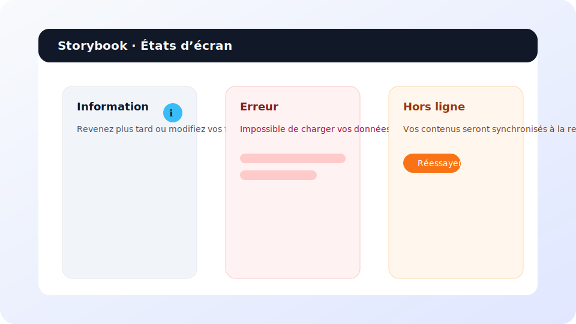

# Guides UI Meetinity

Ces recommandations décrivent l’expérience visuelle et interactive de l’application, ainsi que les composants partagés disponibles dans le design system.

## Design tokens

- **Couleurs** : utilisez les variables CSS définies dans `src/index.css` (`--color-primary`, `--color-surface`, `--color-accent`, etc.) pour assurer la cohérence du thème clair/sombre.
- **Typographie** : la police par défaut est `Inter` avec les tailles normalisées (`--font-size-sm`, `--font-size-md`, …) et les hauteurs de ligne (`--line-height-tight`, `--line-height-normal`).
- **Espacements et rayons** : privilégiez l’échelle `--space-…` et `--radius-…` pour composer les mises en page et les cartes.
- **Élévations** : les ombres (`--shadow-xs` → `--shadow-lg`) permettent de distinguer cartes, modales et menus flottants.
- **Mouvements** : les durées (`--duration-fast|normal|slow`) et courbes (`--easing-standard`, `--easing-emphasized`) sont utilisées dans la navigation et les transitions Storybook.

## États d’interface

Les composants suivants sont centralisés dans `src/features/shared` :

- `ScreenState` : gabarit neutre (`tone` = `neutral`, `info`, `success`, `warning`, `error`).
- `LoadingState` : affiche automatiquement des squelettes (`SkeletonBlock`).
- `ErrorState` : message d’erreur avec action de rechargement.
- `OfflinePlaceholder` : rappel des limites hors ligne.

## Accessibilité

- Le fournisseur `AccessibilityProvider` (voir `src/accessibility`) expose les préférences `fontScale` et `screenReaderHints`.
- Le menu d’accessibilité est accessible depuis l’en-tête principal (icône ♿) et permet d’ajuster la taille des textes et d’activer les aides lecteurs d’écran.
- Les indicateurs de navigation (`TabLayout`) utilisent des badges animés et un `aria-live` pour annoncer la section active lorsque les aides sont activées.

## Responsivité

- Le hook `useResponsiveBreakpoint` (`src/hooks/useResponsiveBreakpoint.ts`) met à disposition `up`, `down` et `between` pour adapter la disposition des composants.
- Exemples : les onglets événements deviennent verticaux sur les écrans larges, la barre de navigation inférieure masque les libellés sur mobile.

## États d’écran

Chaque écran métier affiche :

- Un squelette (`LoadingState`) lors du chargement initial.
- Un message cohérent (`ErrorState` ou `OfflinePlaceholder`) en cas d’erreur ou d’absence de connexion.
- Des composantes informatives (`ScreenState`) lorsque la liste est vide.

## Storybook

- Lancez l’environnement via `npm run storybook`.
- Les stories sont disponibles pour les états d’écran (`ScreenState.stories.tsx`), la fiche profil (`ProfileCard.stories.tsx`) et les cartes événement (`EventCard.stories.tsx`).
- La configuration (addons a11y, backgrounds, contrôles) se situe dans `.storybook/main.ts` et `.storybook/preview.ts`.
