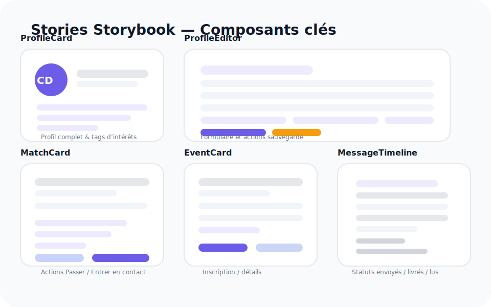

# Guides UI Meetinity

Ces recommandations décrivent l’expérience visuelle et interactive de l’application ainsi que les composants partagés disponibles dans le design system.

## Design tokens

- **Couleurs** : utilisez les variables CSS définies dans `src/index.css` (`--color-primary`, `--color-surface`, `--color-accent`, etc.) pour assurer la cohérence du thème clair/sombre.
- **Typographie** : la police par défaut est `Inter` avec les tailles normalisées (`--font-size-sm`, `--font-size-md`, …) et les hauteurs de ligne (`--line-height-tight`, `--line-height-normal`).
- **Espacements et rayons** : privilégiez l’échelle `--space-…` et `--radius-…` pour composer les mises en page et les cartes.
- **Élévations** : les ombres (`--shadow-xs` → `--shadow-lg`) permettent de distinguer cartes, modales et menus flottants.
- **Mouvements** : les durées (`--duration-instant|fast|normal|slow`) et courbes (`--easing-standard`, `--easing-emphasized`, `--easing-spring`) sont utilisées dans les transitions applicatives et Storybook.

## Thématisation & Storybook

- Les stories sont enveloppées par `ThemeProvider` (`src/theme/ThemeProvider.tsx`) qui injecte les tokens définis dans `src/theme.ts` sous forme de variables CSS. Il devient ainsi possible de basculer vers d’autres jeux de couleurs sans réécrire les composants.
- `AccessibilityProvider` (voir `src/accessibility`) reste appliqué via `.storybook/preview.ts` pour exposer `fontScale` et les aides lecteurs d’écran.
- Les contrôles de backgrounds Storybook reprennent les couleurs du thème (`surface`, `fond`) pour visualiser le rendu clair ou de contraste.

## États d’interface partagés

Les composants suivants sont centralisés dans `src/features/shared` :

- `ScreenState` : gabarit neutre (`tone` = `neutral`, `info`, `success`, `warning`, `error`).
- `LoadingState` : affiche automatiquement des squelettes (`SkeletonBlock`).
- `ErrorState` : message d’erreur avec action de rechargement.
- `OfflinePlaceholder` : rappel des limites hors ligne.

## Composants clés documentés

### ProfileCard

- Stories : `ProfilComplet`, `AvecPhoto`, `PréférencesPartagées`, `AppelÀAction`, `ProfilMinimal`.
- Usage : présenter un profil dans les flux et listes, mettre en avant intérêts et liens, afficher l’action d’édition uniquement lorsqu’elle est pertinente.
- Accessibilité : la lettre de secours agit comme avatar alternatif, les puces respectent le contraste AA et le bouton “Modifier” conserve un focus visible.

### ProfileEditor

- Stories : `EditionComplète`, `RecadrageAvatar`, `SauvegardeEnCours`, `ErreurDeSoumission`, `ProfilAllégé`.
- Usage : formulaire exhaustif pour éditer un profil avec prévisualisation d’avatar, sections dynamiques (expériences, liens) et préférences de mise en relation.
- Accessibilité : chaque champ est associé à son message d’erreur via `aria-describedby`, le message d’échec serveur est exposé via `role="alert"` et les contrôles de recadrage restent navigables au clavier.

### MatchCard

- Stories : `SuggestionStandard`, `CompatibilitéÉlevée`, `SansActions`, `ActionsJournalisées`, `ProfilAvecLiens`.
- Usage : mettre en avant une suggestion de mise en relation dans le carrousel de découverte, afficher le pourcentage de compatibilité et les intérêts partagés.
- Accessibilité : les actions sont de vrais boutons, la jauge de compatibilité est rendue sous forme de texte et les liens externes précisent `rel="noreferrer"`.

### EventCard

- Stories : `Disponible`, `Inscrit`, `Complet`, `Synchronisation`, `SansLienSecondaire`.
- Usage : fiche événement avec statut d’inscription, catégorie colorée et jauge de participation.
- Accessibilité : le bouton principal passe en `disabled` lorsqu’un événement est complet, conserve un focus visible et annonce l’état courant (“Synchronisation…”, “Complet”).

### MessageTimeline

- Stories : `ConversationActive`, `AvecPiecesJointes`, `EnvoiEnCours`, `ToutLu`.
- Usage : afficher l’historique d’une conversation en listant les messages entrants/sortants, pièces jointes et statuts de livraison.
- Accessibilité : les statuts “Lu/Envoi…” sont inclus dans la légende textuelle, les boutons de réessai sont clairs et `aria-live="polite"` est activé pour les messages en attente.

## Accessibilité

- Le fournisseur `AccessibilityProvider` (voir `src/accessibility`) expose les préférences `fontScale` et `screenReaderHints`.
- Le menu d’accessibilité est accessible depuis l’en-tête principal (icône ♿) et permet d’ajuster la taille des textes et d’activer les aides lecteurs d’écran.
- Les indicateurs de navigation (`TabLayout`) utilisent des badges animés et un `aria-live` pour annoncer la section active lorsque les aides sont activées.

## Responsivité

- Le hook `useResponsiveBreakpoint` (`src/hooks/useResponsiveBreakpoint.ts`) met à disposition `up`, `down` et `between` pour adapter la disposition des composants.
- Exemples : les onglets événements deviennent verticaux sur les écrans larges, la barre de navigation inférieure masque les libellés sur mobile.

## États d’écran

Chaque écran métier affiche :

- Un squelette (`LoadingState`) lors du chargement initial.
- Un message cohérent (`ErrorState` ou `OfflinePlaceholder`) en cas d’erreur ou d’absence de connexion.
- Des composantes informatives (`ScreenState`) lorsque la liste est vide.

## Storybook

- Lancez l’environnement via `npm run storybook`.
- Les stories couvrent désormais les états d’écran (`ScreenState.stories.tsx`), le profil (`ProfileCard.stories.tsx`, `ProfileEditor.stories.tsx`), la découverte (`MatchCard.stories.tsx`), les événements (`EventCard.stories.tsx`) et la messagerie (`MessageTimeline.stories.tsx`).
- La configuration (addons a11y, backgrounds, contrôles) se situe dans `.storybook/main.ts` et `.storybook/preview.ts`.

